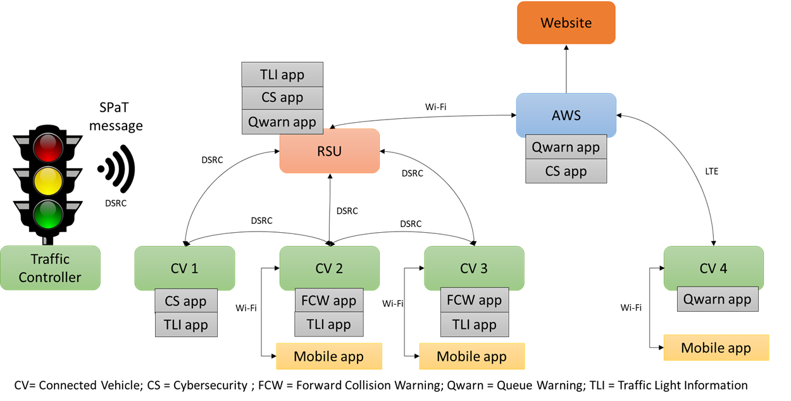

# Connected Vehicle (CV) Environment Prototype Project

The goal of this project is to create a small scale Connected vehicle (CV) environment where components are connected and exchange data and run computational task such as CV applications. This repository contains the code of each connected devices. 

### Prototype CV System Architecture

